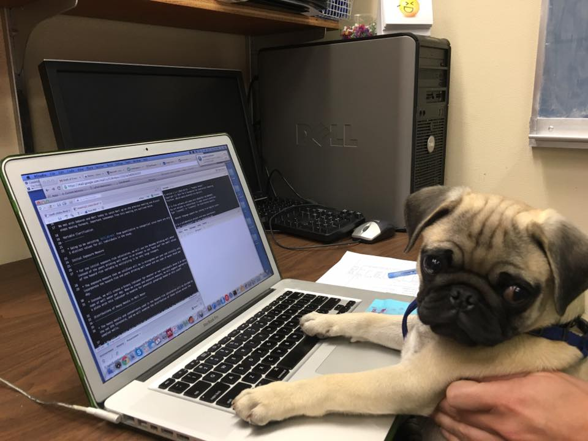
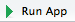
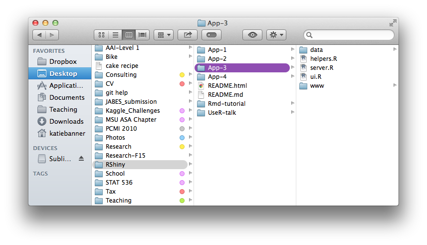

## What is Shiny? 

- Shiny lets you make interactive web applications using R     

- Shiny lets you do _reactive_ programming easily in R 


##
```{r, datavis, echo = FALSE, warning = FALSE, message = FALSE}
counties <- readRDS("census-vis/data/counties.rds")
renderDataTable(counties)
```

## Ex: 2010 US Census data visualization
```{r, census, echo = FALSE, warning=FALSE, message=FALSE} 
library(maps)
library(mapproj)
source("census-vis/helpers.R")
fluidPage(
  sidebarLayout(
    sidebarPanel(
      helpText("Create demographic maps:"), 
      selectInput("select", label = h4("Choose a variable to display"), 
                  choices = list("Percent White", "Percent Black",
                                "Percent Hispanic", "Percent Asian"), 
                  selected = "Percent White"), 
      sliderInput("range", label = h4("Choose a range of interest:"), 
                  min = 0, max = 100, value = c(0,100))
    ),
  mainPanel(
    
  renderPlot({
    data <- switch(input$select, 
                   "Percent White" = counties$white, 
                   "Percent Black" = counties$black, 
                   "Percent Hispanic" = counties$hispanic,
                   "Percent Asian" = counties$asian)
    color <- switch(input$select, 
                   "Percent White" = "darkgreen", 
                   "Percent Black" = "darkviolet", 
                   "Percent Hispanic" = "darkblue",
                   "Percent Asian" = "darkorange")
    label <- switch(input$select, 
                   "Percent White" = "% White", 
                   "Percent Black" = "% Black", 
                   "Percent Hispanic" = "% Hispanic",
                   "Percent Asian" = "% Asian")
    
    percent_map(var = data, 
                color = color, 
                legend.title = label, 
                max = input$range[2], 
                min = input$range[1])
    }), 
  br(),
  p("This app was created and adapted using lesson 5 in", 
    img(src = "../App-3/www/bigorb.png", height = 40, width = 40),
    span("RStudio's", style = "color:blue"), "Shiny tutorial")
    )
  )
)
```


## Prerequisites? 

- Familiarity with R 
- A little bit of patience 
- _Optional:_ familiarity with R Markdown

__Bottom Line: If you can write R code you can use shiny!__ 

>- 

## How does one "learn" to use Shiny? 

- Same way you learned to use R  

    - R Studio has a great tutorial [http://shiny.rstudio.com/tutorial/](http://shiny.rstudio.com/tutorial/)
    - Slides that I found very useful [bit.ly/shinySEATTLE](http://www.bit.ly/shinySEATTLE)


## Creating shiny apps

Two ways: 

1. Write a `ui.R` and `server.R` file 
    
2. Write a `.Rmd` file  

    >- For interactive documents and presentations  
    >- Include `runtime: shiny` in YAML or `render()`

## `ui.R` file: user interface  

- Controls what your app will look like to the user
- At a minimum you need...
    
```{r, eval = FALSE }
# ui.R with 
shinyUI(fluidPage(

  ))
```

>- Add panels, tabs, and format the appearance using a variety of commands

## `server.R` file: server file

- Contains code for building the app 
- At a minimum you need ... 

```{r, eval = FALSE}
# server.R with 
shinyServer(function(input,output){
  
})
```

## Using a `.Rmd` file 

- Don't need to separate the user interface from the server piece   
- Markdown syntax is required for including apps in interactive documents  

    - __Can't host `.Rmd` files with interactive apps, but anyone with R installed can use them__

- We'll focus on the two-file apps

      >- Easy to translate `ui.R` and `server.R` into `.Rmd` 

## Running an app

- Use the Run button in <div style = "color:blue">RStudio</div>   
- Use the function `runApp("\path\to\App")`




## A simple app 

```{r, echo = TRUE, eval = FALSE}
shinyUI(fluidPage(
  titlePanel(
    h1("Title", align = "center"),
    ), 
  sidebarLayout(
    sidebarPanel(
      h3("Inputs")
      ), 
  mainPanel(
    h3("Output")
    )
  )
))
```

## 

```{r, echo = FALSE}
fluidPage(
  titlePanel(
    h1("Title", align = "center"),
    ), 
  sidebarLayout(
    sidebarPanel(
      h3("Inputs")
      ), 
  mainPanel(
    h3("Output")
    )
  )
  )
```


## Adding widgets to your apps 

- Widgets make apps awesome

    - A widget is a "web element that your users can interact with"
    - Make apps __reactive__
    - _Ouputs_ __react__ to _changing inputs_  

- Shiny has a set of standard widgets [here](http://shiny.rstudio.com/tutorial/lesson3/)

## Shiny widgets 

```{r, widgets, eval = TRUE, echo = FALSE}
fluidPage(
  fluidRow( 
    column(4,
      h5(code("actionButton()")),
      actionButton("action", label = "Go!"),
      br(),
      br(), 
      h5(code("submitButton()")),
      submitButton("Submit")),
    
    column(4,
      h5(code("checkboxInput()")),
      h3("TRUE or FALSE"),
      checkboxInput("checkbox", label = "Bozeman is beautiful", value = TRUE)),
    
    column(4, 
      h5(code("checkboxGroupInput()")),     
      checkboxGroupInput("checkGroup", 
        label = h3("Select all that apply"), 
        choices = list("Condition 1" = 1, 
           "Condition 2" = 2, "Condition 3" = 3),
        selected = 1))
    ),
  br(), 
  br(),
  fluidRow(
    column(4,
      h5(code("dateInput()")),
      dateInput("date", 
        label = h3("Select a date"), 
        value = Sys.Date())),   
    
    column(4,
      h5(code("dateRangeInput()")),
      dateRangeInput("dates", label = h3("Select a date range"), 
                     start = Sys.Date(), end = Sys.Date()+7)),
    
    column(4,
      h5(code("fileInput()")),
      fileInput("file", label = h3("Browse...")))
    )
  )
```


## Shiny widgets 

```{r, eval = TRUE, echo=FALSE}
fluidPage(
  fluidRow(
    
    column(4,
           h3(code("radioButtons()")),
      radioButtons("radio", label = h3("Choose one"),
        choices = list("Choice 1" = 1, "Choice 2" = 2,
                       "Choice 3" = 3),selected = 1)),
    
    column(4,
           h3(code("selectInput()")),
      selectInput("select", label = h3("Select one"), 
        choices = list("Choice 1" = 1, "Choice 2" = 2,
                       "Choice 3" = 3), selected = 1)),
    
    column(4, 
      h3(code("sliderInput()")),
      sliderInput("slider1", label = h3("Sliders"),
        min = 0, max = 100, value = 50),
      sliderInput("slider2", " ",
        min = 0, max = 100, value = c(25, 75))
      )
    ),
  fluidRow(
   column(4, 
      h3(code("textInput()")),
      textInput("text", label = h3("Text input"), 
        value = "Enter text...")
      ),
   
   column(4,      
      h3(code("helpText()")),
      helpText("Is not a true widget,", 
        "but provides an easy way to",
        "add text to widgets.")
      ),
   
    column(4, 
      h3(code("numericInput()")),   
      numericInput("num", 
        label = h3("Numeric input"), 
        min = -50, max = 50, step = 1, value = 0)
      )     
    ) 
  )  
```


## Widets let the app user change inputs

- All widgets must have two arguments: `inputId` and `label` 
```{r, actionButton, echo = TRUE}
fluidPage(
  actionButton(inputId = "go", label = "Go!") 
)
```


- `input$go` is the reactive input value
     
     - Tells the server how to react when Go! is clicked 

## Some widgets take more arguments

```{r, num1, echo = TRUE, eval = FALSE}
fluidPage(
  numericInput(inputId = "int", label = "Sample size:")
  )
```

`Error in formatNoSci(value): argument "value" is missing, with no default`

```{r, numInput, echo = TRUE}
fluidPage(
  numericInput(inputId = "int", label = "Sample size:", 
               min = 0, max =100, 
               value = 20,
               step = 1) 
)
```

## What is the name of the input being tracked? 
```{r, numInput2, echo = TRUE, eval= FALSE}
fluidPage(
  numericInput(inputId = "int", label = "Sample size:", 
               min = 0, max =100, 
               value = 20,
               step = 1), 
)
```

>- `input$int` 
>- `input$int = 20`

## Outputs

- Output will depend on the reactive value, `input$int`
- Shiny has a set of `render*()` functions to work with reactive values [full list](http://shiny.rstudio.com/tutorial/lesson4/)

    - `renderText()` 
    
```{r, shinyfun, echo = TRUE, eval = FALSE}
output$text1 <- renderText({print(input$int)})
```

>- Runs all code inside {} anytime `input$int` is changed and stores the result as an output called `text1`
>- `textOutput()` will allow you to place that output somewhere in your `ui.R` file

## A simple app
```{r firstapp, echo = TRUE, eval = FALSE}
# ui.R file 
shinyUI(fluidPage(
      numericInput("int2", "Pick a number between 1 and 100:", 
                   value = NULL, min = 1, max = 100)),
      textOutput("text1")
  ))
# server.R file 
shinyServer(function(input, output){
  output$text1 <- renderText({
    paste("You chose the number ", input$int2)
    })  
})
```

## A simple app 
```{r App1, echo = FALSE, eval = TRUE}
fluidPage(
      numericInput("int2", "Pick a number between 1 and 100:", 
                   value = NULL, 
                   min = 1, 
                   max = 100),
      renderText({paste("You chose the number ", input$int2)})
)
```

>- Maybe I don't want text output to change every time I hit the up arrow on the select input.... 

>- Add an action button to tell the server when to check for an updated input. 

## Action buttons 

```{r App2, echo = FALSE, eval = TRUE}
numericInput("int3", "Pick a number between 1 and 100:", 
             value = NULL, 
             min = 1, 
             max = 100)

actionButton("go", "Go!") 

chosen <- eventReactive(input$go,{
  paste("You chose the number ", input$int3)
  })

renderText({
  chosen()
  })
```

## `ui.R` 
```{r appUI, echo = TRUE, eval = FALSE}
shinyUI(
  fluidPage(
    # add the widget instructing the user select their number
    numericInput("int3", "Pick a number between 1 and 100:", 
                     value = NULL, 
                     min = 1, 
                     max = 100),
    # action button
        actionButton("go", "Go!"), 
    # line break 
        br(), 
    # text output
        textOutput("text1")
  ))
```

## `server.R` 
```{r appServ, echo = TRUE, eval = FALSE}
shinyServer(function(input, output) {
  
  # only update input$int3 when if input$go is clicked
  chosen <- eventReactive(input$go,{
    paste("You chose the number ", input$int3)
  })
  # create the output object
    output$text1 <- renderText({
      chosen()
  })  
})
```

## Example: Randomly select one child from a family

```{r, randapp, echo = FALSE}
numericInput(inputId = "num.child",
             label = h4("Enter the number of children in the family"),
             value = NULL, 
             min = 2, 
             max =20, 
             step = 1)

actionButton(inputId = "randomize", label = "Randomize")

child <- eventReactive(input$randomize,{
  paste("select child #", sample(1:input$num.child, 1), sep = " ")
  })

renderText({
  child()  
  })
```

## Poisson exploration

```{r poisApp, echo = FALSE, eval = TRUE}
source("pois-explore/helpers.R")
numericInput(inputId = "lambda", 
             label = "Choose a value for the mean of your Poisson distribution:", 
             value = NULL, 
             min = 1, 
             max = 10000, 
             step = 1)
actionButton(inputId = "plot", label = "Plot Data")
poisData <- eventReactive(input$plot, {
      list(rpois(1000,input$lambda), input$lambda)
    }) 
renderPlot({
        poisPlot(pois.vec = poisData()[1], 
                 main = paste("Poisson(lambda = ", poisData()[2], ")"))
        })
```

## Try to recreate that app!

_Tips:_ 

- The file _helpers.R_ in _pois-explore_ contains a plotting function called `poisPlot()`
    - You can source this file in `server.R` __before__ `shinyServer(function{input, output})` 
- Use `renderPlot()` and `plotOutput()` instead of `renderText()` and `textOutput()` 
- One solution is in _pois-explore_ 


## RStudio's example

```{r, echo=FALSE}
inputPanel(
 checkboxInput(inputId = "counts", label = "Frequency",
               value = FALSE),
   
  selectInput(inputId = "num", label = "# of bins:",
               choices = c(10, 20, 35, 50), selected = 10),

  sliderInput(inputId = "bw_adjust", label = "Bandwidth adjustment:",
              min = 0.2, max = 3, value = 1, step = 0.2)
)

renderPlot({
  hist(faithful$eruptions, nclass = as.numeric(input$num),
       xlab = "Duration (minutes)", 
       main = "Geyser eruption duration", 
       freq = input$counts) 
  
  dens <- density(faithful$eruptions, adjust = input$bw_adjust)
  lines(dens, col = "blue", lwd = 2) 
         
})
```

## Thanks to 

  <div style = "color:blue">RStudio</div> 

- Shiny tutorial [http://shiny.rstudio.com/tutorial/](http://shiny.rstudio.com/tutorial/)
- Shiny lectures [bit.ly/shinySEATTLE](http://www.bit.ly/shinySEATTLE)


## 


 


